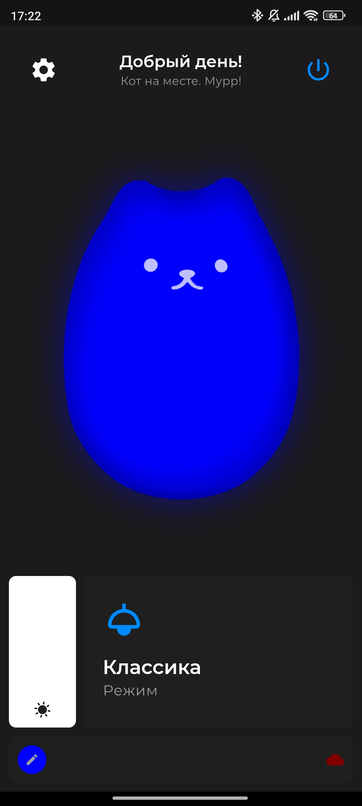

<p align="center">
   <a href="https://github.com/StarPandaBeg/cattyled-app">
    
   </a>

   <h3 align="center">CattyLED</h3>

   <p align="center">
      Удобное управление умной лампой Catty
   </p>
</p>

---



# Функционал и фишки

- Управление лампой по MQTT-протоколу
- Удобная синхронизация с лампой-парой
- Поддержка обновлений по воздуху
- Приятная индикация состояния
- Кот!

# Сборка

Приложение использует Flutter, для его настройки посетите [официальный сайт.](https://flutter.dev)

Для сборки необходимо настроить путь к Android SDK в `android/local.properties`

```
sdk.dir=path/to/sdk
flutter.sdk=path/to/flutter/sdk
```

После этого создайте файл .env, где необходимо задать переменные среды для сборки:

```
UPDATE_URL="https://example.com/LampID"
```

## Отладка

```bash
$ flutter run --dart-define-from-file .env
```

## Релиз

Для релиза необходимо указать путь к хранилищу для подписи `.apk` в `local.properties`:

```
STORE_FILE=path/to/keystore.jks
STORE_PASSWORD=12345678
KEY_ALIAS=key0
KEY_PASSWORD=12345678
```


```bash
$ flutter build apk --dart-define-from-file .env
```

## P.S. Сделано StarPanda с ❤